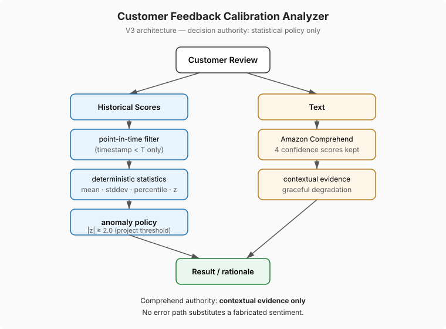

# Customer Feedback Calibration Analyzer — V3

Detects **calibration anomalies**: customer scores that are unusual
relative to *that reviewer's own* historical scoring pattern, using
**strict point-in-time calibration** — a review at time T sees only
observations with timestamp strictly earlier than T.
**Synthetic data only. Advisory output only.**

## What it does

1. Loads `data/mock_reviews.csv` (deterministic, seed=42, all fictional,
   deliberately written out of chronological order).
2. Classifies each review's sentiment via a swappable `SentimentProvider`:
   rule-based lexicon (default, zero cost) or Amazon Comprehend
   (`--sentiment comprehend`, opt-in). All four Comprehend confidence
   scores are stored; the probability vector is never discarded.
3. For each review, computes baseline statistics from the reviewer's
   **strictly prior** observations: count, mean, sample stddev, empirical
   percentile, z-score. Same-timestamp records never see each other.
4. Flags `calibration_anomaly` when |z| >= 2.0 (configurable project
   policy in `src/alignment.py`, not a statistical truth). **The flag can
   never depend on sentiment output** — regression-tested.
5. Writes `data/analyzed_reviews.csv` and `data/report.txt`.

## Run

```bash
python3 scripts/gen_mock.py                  # regenerate synthetic data (optional)
python3 src/main.py                          # rule-based sentiment (default)
python3 src/main.py --sentiment comprehend   # Amazon Comprehend (needs AWS creds)
python3 -m unittest discover -s tests -v     # 31 tests, no AWS needed
python3 scripts/demo_forced_failure.py       # Comprehend outage demo (no AWS needed)
RUN_AWS_INTEGRATION_TESTS=1 python3 -m unittest tests.test_comprehend_integration  # opt-in live test
```

boto3 is required only for `--sentiment comprehend`. Everything else is stdlib.
The Streamlit dashboard lives in `app/` (needs the venv: `.venv/bin/streamlit run app/streamlit_app.py`).

## Architecture



Decision authority: statistical policy only. Comprehend authority: contextual evidence only.

## Graceful degradation of auxiliary inference (V2)

"Fail-open/fail-closed" is the wrong frame — nothing is accepted that
should have been rejected. The precise behavior: Comprehend is an
auxiliary inference service, and its failure degrades the rationale
without touching the deterministic calibration engine.

- Comprehend outage, throttling, per-document errors, oversize input, or
  malformed responses → `sentiment_status = "unavailable"`, label `None`.
- The calibration analysis still completes; the rationale notes that
  sentiment was unavailable and the determination used history only.
- **No error path converts unavailable into a default NEUTRAL.** Unit-tested.
- Comprehend output is recorded as evidence, not ground truth. No LLM.

Forced-failure demo (`scripts/demo_forced_failure.py`) — the same anomaly
decisions with Comprehend working vs. fully dead:

```
Reviews: 303
Comprehend working: 3 anomalies flagged
Comprehend dead:    3 anomalies flagged, 303 sentiments unavailable
Identical anomaly decisions: True
  - r_avg score=4 at 2026-01-21T09:45:40: still flagged with sentiment_status=unavailable
  - r_planted score=4 at 2026-03-01T12:00:00: still flagged with sentiment_status=unavailable
  - r_zerovar score=5 at 2026-03-01T12:00:00: still flagged with sentiment_status=unavailable
```

## Locked design constraints

1. **Point-in-time.** History for a review at T is the same reviewer's
   observations with timestamp strictly < T. Future data cannot leak:
   adding or changing reviews dated after the target provably cannot
   change its baseline, z-score, percentile, status, or flag (tested).
   Same-timestamp records never contribute to one another. Reviews without
   a timestamp use the V2 leave-one-out approximation as a documented
   legacy path.
2. **Zero variance is explicit.** `baseline_status = zero_variance_baseline`,
   z-score undefined (`None`). A score matching the constant pattern is
   consistent; any deviation is an anomaly.
3. **z is a deviation metric, not proof.** Scores are bounded and discrete
   (1–10); empirical percentile is reported alongside because reviewer
   distributions are rarely normal.
4. **Deterministic, configurable threshold.** `MIN_HISTORY = 10`,
   `ANOMALY_THRESHOLD_ABS_Z = 2.0` live as named constants. Reviewers
   below the history minimum get `insufficient_history` — an explicit
   status, never an invented baseline. Early-history observations are
   therefore uncalibrated by design, not by accident.
5. **Terminology.** "Calibration anomaly", never "mismatch". A mismatch
   implies one side is correct; the engine only measures unusualness
   relative to reviewer history.

## Known limitation

Leave-one-out (the no-timestamp legacy path) is a documented
approximation; the timestamped path is strict. Within the timestamped
path, the method is exact.

## Test suite

31 tests, 0 AWS calls in the default run:

- `test_sentiment.py` — rule-based classifier incl. raw-count preservation
- `test_alignment.py` — calibration policy (leave-one-out legacy path)
- `test_v2_sentiment.py` — Comprehend provider: four-score mapping, partial
  batch failure, throttling → unavailable, oversize input, 25-doc batching,
  flag identical across all Comprehend labels and under total outage
- `test_v3_temporal.py` — future-data isolation, same-timestamp exclusion,
  out-of-order input invariance, threshold crossing (10th insufficient /
  11th sufficient), legacy path
- `test_comprehend_integration.py` — opt-in live AWS test (skipped by default)

## Boundaries

- Synthetic reviews only. Never feed real client comments, employee
  evaluations, or PII into this project.
- Advisory only: every anomaly rationale ends with "Human review
  recommended; do not auto-adjust." The tool never changes a rating or
  evaluates an employee.

## Resume bullet

Built a Python customer-feedback calibration system using point-in-time
reviewer histories to detect anomalous ratings while isolating Amazon
Comprehend sentiment from deterministic decision logic; preserved full
model confidence vectors, implemented graceful inference degradation and
zero-variance/insufficient-history handling, and regression-tested that
probabilistic NLP output cannot alter anomaly classifications.
